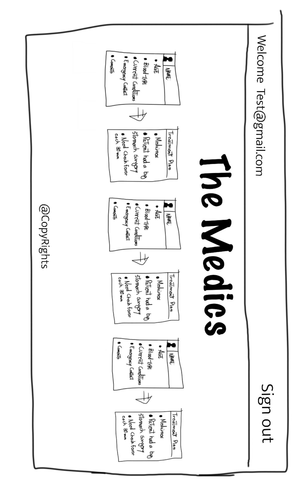
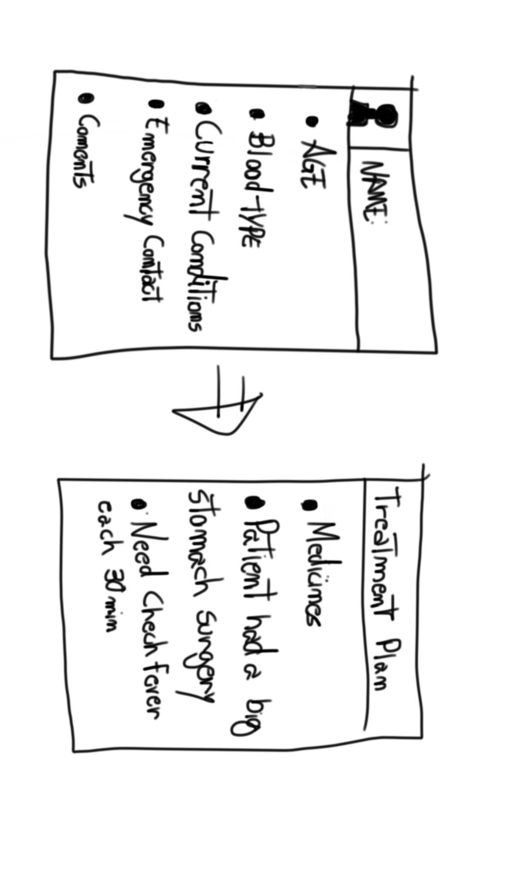

# GA Project 3 - Patient Portal

## Sales Pitch
A tool for doctors and nurses to monitor and update patient conditions, medications, treatments, and other critical details.

## Roles
- Nick - Team Manager
- Pedro - Frontend SME
- Larry - Backend SME

## Pictures

## General Approach
Patient data is seeded in the mongoDB server according to the patient model. After that, the data can be manipulated by authenticated users inside the client.

We are using React with functional components for the frontend client application, and Express with Mongoose to connect to the MongoDB server on the backend.

## Installation Instructions
You need to install dependencies with `npm install`.
After that, `npm start` will launch both the mongoDB server and the react client.

## User Stories
- As an unauthenticated user, I want to be able to sign up.
- As an unauthenticated user, I want to be able to log in.
- As an authenticated user, I want to be able to change my password.
- As an authenticated user, I want to be able to log out.
- As an authenticated user, I want to be able to see all patients.
- As an authenticated user, I want to be able to see a single patient.
- As an authenticated user, I want to be able to create/enter a patient into the system.
- As an authenticated user, I want to be able to edit/update a patient's details.
- As an authenticated user, I want to be able to add a treatment plan to a patient.
- As an authenticated user, I want to be able to delete/discharge a patient.
- As an authenticated user, I want to be able to see all medications associated with a patient.
- As an authenticated user, I want to be able to add a medication to a patient.
- As an authenticated user, I want to be able to update the medication on a patient.
- As an authenticated user, I want to be able to delete a medication off a patient's chart.

## Models
- User
    - Username
    - Password
    - Token
    - Patients

- Patient
    - Name
    - Age/DOB
    - Blood Type
    - Emergency Contact Telephone #
    - Preexisting Conditions
    - Current Condition
    - Treatment Plan/Duration
    - Doctors
    - Medicines
    - Comments

- Medicine (subdoc)
    - Name
    - Dosage
    - Duration

## Routes
### User Routes
#### React
| Endpoint                 | Component        | Description          | `AuthenticatedRoute?` |
|--------------------------|------------------|----------------------|-----------------------|
| `/users/sign-in`         | `SignIn`         | User sign-in page    | No                    |
| `/users/sign-up`         | `SignUp`         | User sign-up page    | No                    |
| `/users/change-password` | `ChangePassword` | Change password page | Yes                   |
| `users/sign-out`         | `SignOut`        | Signout confirmation | Yes                   |

### Patient Routes
#### React
| Endpoint             | Component       | Description                       | `authenticatedRoute?` |
|----------------------|-----------------|-----------------------------------|-----------------------|
| `/patients/`         | `PatientList`   | Display of all patients           | Yes                   |
| `/patients/:id`      | `ShowPatient`   | Display of one patient            | Yes                   |
| `/patients/new`      | `NewPatient`    | Container for new patient form    | Yes                   |
| `/patients/:id/edit` | `EditPatient`   | Container for edit patient form   | Yes                   |
| `/patients/delete`   | `DeletePatient` | Confirmation for deleting patient | Yes                   |

#### Express
| REST    | Description           | HTTP Verb | Express Route        |
|---------|-----------------------|-----------|----------------------|
| INDEX   | patient index         | GET       | `/patients`          |
| SHOW    | patient show page     | GET       | `/patients/:id`      |
| NEW     | new patient form      | POST      | `/patients/new`      |
| CREATE  | create new patient    | POST      | `/patients`          |
| EDIT    | edit existing patient | GET       | `/patients/:id/edit` |
| UPDATE  | update patient        | PATCH     | `/patients/:id`      |
| DESTROY | remove patient        | DELETE    | `/patients/:id`      |

### Medicine Routes
#### Express
| REST    | Description           | HTTP Verb | Express Route        |
|---------|-----------------------|-----------|----------------------|
| NEW     | create new medicine   | POST      | `/medicines/`        |
| UPDATE  | update medicine       | PATCH     | `/medicines/:id`     |
| DESTROY | remove medicine       | DELETE    | `/medicines/:id`     |

#### React Components
| Component Name        | Description                                                 |
|-----------------------|-------------------------------------------------------------|
| `ShowMedicine`        | Main container for medicine details and UI options          |
| `CreateMedicineModal` | Modal that appears on ShowPatient page to create a medicine |
| `EditMedicineModal`   | Modal that appears on ShowPatient page to edit a medicine   |

## Stretch Goals
- Alert system
- Discharged patients go into an archive with a cause

## Wireframes

### Component Hierarchy
- App
    - Header
    - Home
        - HomePage
        - Auth
            - SignIn
            - SignOut
            - SignUp
            - ChangePassword
        - PatientList
        - ShowPatient
            - PatientDetails
            - TreatmentPlan
                - ShowMedicine
                - CreateMedicineModal
                - EditMedicineModal
            - EditPatientModal
            - DeletePatientModal
        - NewPatient

## Entity Relationship Diagram

## Major Hurdles/Unsolved Problems